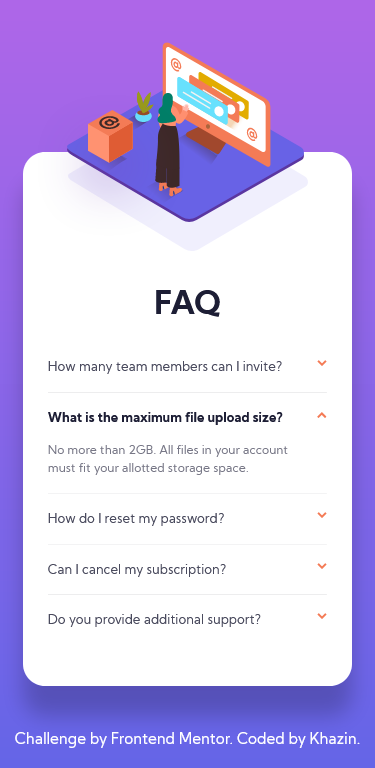
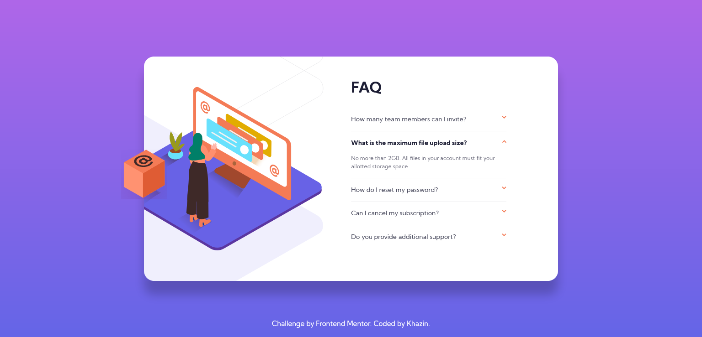

# Frontend Mentor - FAQ accordion card solution

This is a solution to the [FAQ accordion card challenge on Frontend Mentor](https://www.frontendmentor.io/challenges/faq-accordion-card-XlyjD0Oam). Frontend Mentor challenges help you improve your coding skills by building realistic projects. 

## Table of contents

- [Overview](#overview)
  - [The challenge](#the-challenge)
  - [Screenshot](#screenshot)
  - [Links](#links)
- [My process](#my-process)
  - [Built with](#built-with)
  - [Continued development](#continued-development)
  - [Useful resources](#useful-resources)
- [Author](#author)

**Note: Delete this note and update the table of contents based on what sections you keep.**

## Overview

### The challenge

Users should be able to:

- View the optimal layout for the component depending on their device's screen size
- See hover states for all interactive elements on the page
- Hide/Show the answer to a question when the question is clicked

### Screenshot

### Links

- Solution URL: [https://github.com/khazin/FAQ-accordion-card](https://github.com/khazin/FAQ-accordion-card)
- Live Site URL: [https://khazin.github.io/FAQ-accordion-card/](https://khazin.github.io/FAQ-accordion-card/)

## My process

### Built with

- Semantic HTML5 markup
- CSS custom properties
- Flexbox
- CSS Grid
- Mobile-first workflow
- SCSS

### Continued development

- refactor code
- write better codes
- use best practices
- learn new and unfamiliar concept

### Useful resources

- [https://www.youtube.com/watch?v=pzy_QStQaqA](https://www.youtube.com/watch?v=pzy_QStQaqA) - This video helped me for creating accordion.
- [https://levelup.gitconnected.com/understanding-use-of-the-and-symbols-in-css-selectors-95552eb436f5](https://levelup.gitconnected.com/understanding-use-of-the-and-symbols-in-css-selectors-95552eb436f5) - This is an amazing article which helped me finally understand how to use symbol in css selectors.

## Author

- Frontend Mentor - [@khazin](https://www.frontendmentor.io/profile/khazin)
- Twitter - [@khazin](https://www.github.com/khazin)
